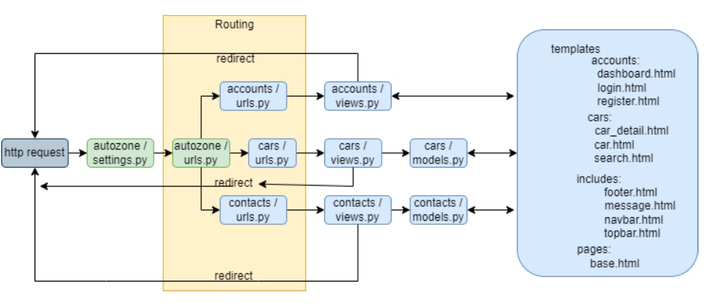
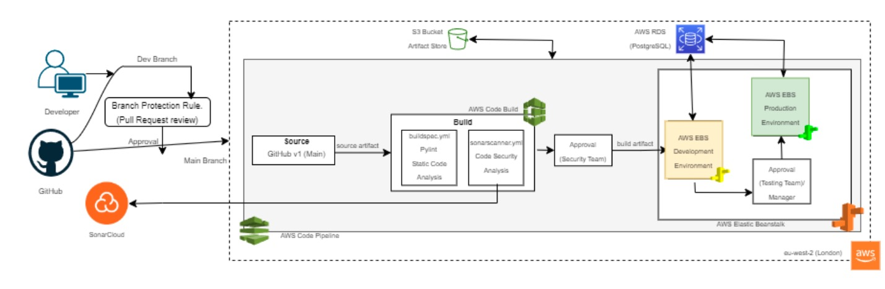

# DevSecOps Pipeline AutoZone

### [View all Roadmaps](https://github.com/nholuongut/all-roadmaps) &nbsp;&middot;&nbsp; [Best Practices](https://github.com/nholuongut/all-roadmaps/blob/main/public/best-practices/) &nbsp;&middot;&nbsp; [Questions](https://www.linkedin.com/in/nholuong/)

#### The web-based application AutoZone enables users to post purchase requests and administrators to advertise used automobile sales. 
#### This project’s objective is to build a CI/CD pipeline utilizing the DevSecOps approach to guarantee the application is delivered without interruption. 
#### This project follows the software development lifecycle, starting with the planning phase during which requirements are gathered, then moving on to the defining phase during which needs are organized and a broad architecture is built. The actual coding procedure is the last step in the programming phase. 
#### The AWS Code Pipeline is used to deploy the application to the production environment after the development environment in EBS, where it first undergoes testing for bugs. 
#### For security and static code analysis, the project also makes use of AWS Code Build. The code build project uses a.yml file to construct environments and secure code. 
#### The CI/CD pipeline is built from the ground up, and updates are tested in real time while the application is still running. In conclusion, the goal of this project is to create AutoZone, a dynamic Python Django application that is hosted on the AWS cloud platform and follows the DevSecOps philosophy. 
#### To ensure smooth delivery of the application, a CI/CD pipeline will be constructed for it utilizing AWS Code Pipeline, AWS Code Build, and AWS Elastic Beanstalk. The project uses static code analysis, adheres to the software development lifecycle, and tests updates on the live application without any interruptions.

#### Till now, I have discussed all the parts in DevSecOps and what configurations are done in each part of this project. In this section, I will be explaining the whole CI CD pipeline when a developer pushes a new feature update from his local and it changes on the production environment in AWS Elastic Beanstalk.
#### Suppose Developers want to add a feature update to show ”is featured” column on the ”cars” dashboard Fig.11. (current UI) from where the admins should be able to directly update the ’is featured” tag on the listed cars. So here the changes will be made following the AWS DevSecOps pipeline (Fig. 10). 
#### Developer starts with adding the changes in his local system and then push to the ’dev’ branch on GitHub and a pull request is raised to merge the changes into the ’main’ branch, which is then reviewed by the stakeholder and the changes are merged to the ’main’ branch. Once the changes are pushed to the ’main’ branch it will trigger our AWS Code Pipeline and the code will be zipped to S3 bucket as a source artifact. 
#### This source artifact is sent to the AWS Code Build action group in the Build phase where the environment is built, the database migrations are done and static code analysis is done using Pylint. 
#### Once one build stage is successful SonarScan analysis is done and a report is generated on SonarCloud Dashboard showing up the vulnerabilities and bugs in the code and pylint report can be found on AWS Code build logs which are then reviewed by the security team to approve or reject the pipeline. 
#### Once the reviews are approved the output of the build phase which is ’build artifact’ is sent to the ’deploy’ phase where the changes are deployed into the development environment on AWS Elastic Beanstalk. Here ”testing team” can come in and test the changes in the development environment if the changes that were made are working as expected for example here ’is featured’ column is added and the admin is able to update the column from the dashboard before pushing the changes to the production environment. 
#### Once it is approved by the Testing team then BuildArtifacts are sent to the ’Production Environment’ hence the final changes are deployed to the live environment without any manual efforts or downtime Fig.12 (final changes). AWS SNS is used for the approval notification here, where the subscribers are sent approval requests via email.

# I'm are always open to your feedback.  Please contact as bellow information:
### [Contact ]
* [Name: nho Luong]
* [Skype](luongutnho_skype)
* [Github](https://github.com/nholuongut/)
* [Linkedin](https://www.linkedin.com/in/nholuong/)
* [Email Address](luongutnho@hotmail.com)

# License
* Nho Luong (c). All Rights Reserved.

